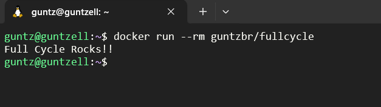
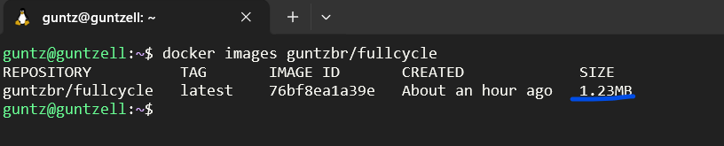

Desafio Golang - FullCycle - Docker

- Você terá que publicar uma imagem no docker hub. Quando executarmos:
docker run <seu-user>/fullcycle
Temos que ter o seguinte resultado: Full Cycle Rocks!!

- A imagem de nosso projeto Go precisa ter menos de 2MB

